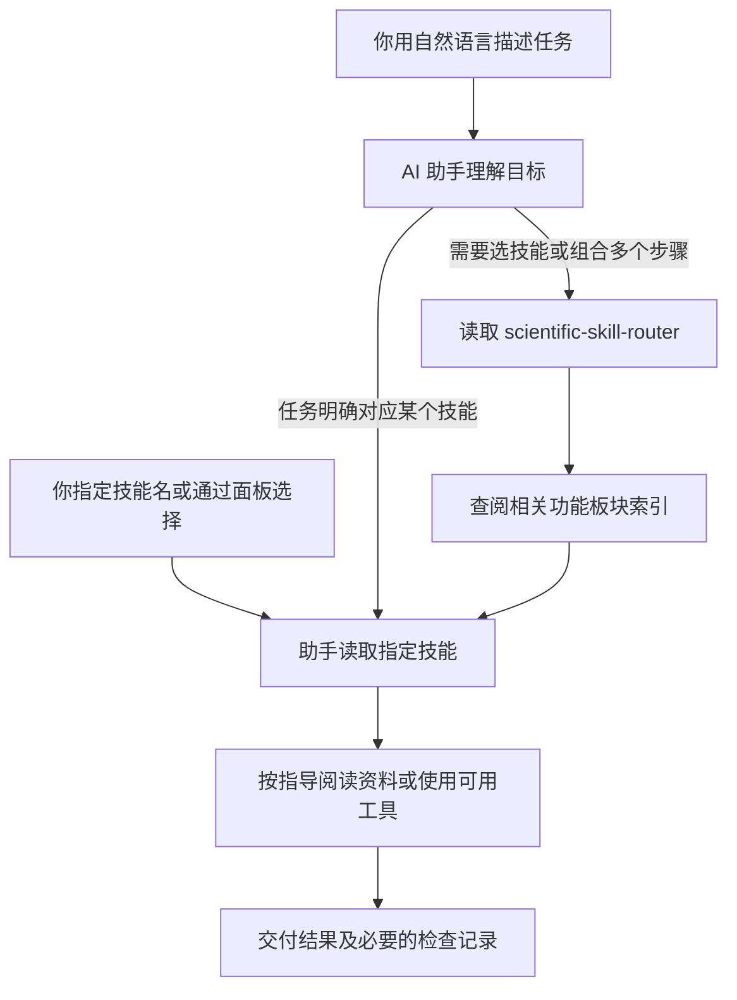

# LLMskill-forChem

> 本仓库新增代码由 **GPT-6 Astra** 生成，人工部分仅为向 LLM 提出需求和指定 skill。引用的上游技能及代码保留原作者署名、来源与许可证。

面向化学与材料研究者的开源技能集合，提供中文用途说明、按板块选择技能的入口，以及适用于 Windows 和 Linux/WSL 的安装工具。

这个项目起源于作者使用相关工具时的困扰：开源科研技能项目很多，化学与材料相关内容常常散落在大量其他领域的技能中；同时安装多个项目，又会增加配置、筛选和维护的负担。因此，本仓库将部分开源项目中的相关技能集中整理，提供一个方便起步、节省自行搜集时间的选择，也可以把它理解为一个“懒人包”。收录基于作者有限的使用需求与了解，未经过全面比较或效果验证，不保证更高效，也不一定适合每个人。有经验的使用者更适合按自己的研究方向选择、调整和验证技能。

Skill 是供 AI 助手读取的任务指导和配套资源。安装后，你可以直接用中文描述任务，或指定技能名称，让助手按相应流程处理。

## 可以用来做什么

本仓库收录 **44 项技能**，包括按功能组织的43项具体技能，以及1项技能选择入口。不同来源的同类技能放在同一板块中。

| 任务 | 技能示例 |
| --- | --- |
| 晶体、分子与化学数据处理 | `pymatgen`、`rdkit`、`datamol` |
| 光谱、反应动力学与相平衡 | `nmrglue`、`matchms`、`cantera`、`pycalphad` |
| 文献检索与引用管理 | `paper-lookup`、`literature-review`、`citation-management` |
| 科研论证与实验设计 | `hypothesis-generation`、`experimental-design`、`scientific-critical-thinking` |
| 数据分析、统计与机器学习 | `statistical-analysis`、`scikit-learn`、`pymc`、`shap` |
| 科研写作、绘图与汇报 | `scientific-writing`、`seaborn`、`scientific-visualization`、`scientific-slides` |
| 原文、文献与参考文献核验 | `reading-contract`、`lit-review`、`ref-check` |
| 验证独立性 | `independence-bookkeeping` |

[完整功能目录、用途与依赖](docs/skills-catalog.md) · [使用指南](docs/usage.md)

## 安装

需要 **Python 3.10 或更新版本**，以及支持本地 Skills 的 AI 助手。安装工具仅使用 Python 标准库；具体技能所需的科学软件、Python 版本和外部服务另有要求。

先克隆仓库，或在 GitHub 点击 **Code → Download ZIP** 并解压：

```bash
git clone https://github.com/Tritium-33/LLMskill-forChem.git
cd LLMskill-forChem
```

使用 ZIP 时，在解压后的仓库目录打开终端即可，不需要运行上面的克隆命令。

### Windows

在仓库目录打开 PowerShell：

```powershell
py -3 tools/manage.py list
py -3 tools/manage.py install --dry-run
py -3 tools/manage.py install
```

默认安装到当前 Windows 用户的 `.agents\skills`。如果你的 Python 命令是 `python`，将 `py -3` 替换为 `python`。

### Linux / WSL / macOS

在仓库目录运行：

```bash
python3 tools/manage.py list
python3 tools/manage.py install --dry-run
python3 tools/manage.py install
```

默认安装到 `~/.agents/skills`。Windows 原生助手和 WSL 中的助手使用不同的用户目录，请在助手实际运行的环境中安装。

### 只安装需要的技能

例如只安装 `paper-lookup`：

```bash
python3 tools/manage.py install --skill paper-lookup
```

Windows 将 `python3` 换成 `py -3`。可重复传入 `--skill` 选择多项，用 `--target` 指定宿主读取的技能目录。选择入口不会自动补装其他技能；希望使用完整板块选择功能时，可按上面的默认方式安装全部技能。

**目前暂未测试 DeepSeek Harness（DSH）兼容性。** 相关配置说明仅供参考，不代表已验证可用。

更多选项见 [安装、更新与卸载](docs/install.md)；Codex、DeepSeek Harness（DSH）及不同平台的说明见 [兼容性说明](docs/compatibility.md)。

## 怎么调用

安装后，在 AI 助手对话中直接描述任务，例如：

- “查找这个主题的论文，保留 DOI 和来源，说明哪些读到了全文。”
- “检查这个 CIF 的元素、晶胞和周期性结构。”
- “分析这份数据的缺失值，并绘制带单位和误差条的图。”
- “核验这份参考文献的作者、题名、年份和 DOI。”

也可以指定英文技能名：

> 请使用 `paper-lookup` 检索这个主题的论文。

在 Codex 中可以显式调用：

```text
$paper-lookup 检索这个主题的论文，并保留 DOI 和来源。
```

这里的 `$技能名` 是对话中的调用方式，不是在终端运行的命令。自然语言自动匹配取决于宿主和模型。

## 一句话如何变成实际操作？

可以把使用过程理解为：你提出科研任务，AI 助手查阅合适的操作说明，再使用手边的软件或资料完成工作。Skill 类似一份供助手阅读的实验操作规程（SOP），可能附带脚本、参考资料和模板；真正理解要求、选择步骤和操作工具的是 AI 助手。

| 组成 | 在本项目中负责什么 | 类比 |
| --- | --- | --- |
| AI 助手，例如 Codex | 接收任务，让模型读取技能，并提供文件、终端、联网等可用工具 | 执行任务的助手及其工作环境 |
| `scientific-skill-router` | 根据任务查阅功能索引，建议使用哪些技能、按什么顺序使用 | 帮忙查找合适操作规程的目录指南 |
| 具体 skill | 说明某类任务的步骤、检查事项和所需资源 | 一份操作规程 |
| 科学软件、脚本或外部服务 | 实际处理结构、计算数据、绘图或查询文献 | 仪器与数据库 |
| 图形选择面板（可选） | 帮你找到技能名称并插入请求，或复制后粘贴 | 点选目录的界面 |



**这张图表示本项目期望的选择方式。** 选择入口本身也是一份 skill，由模型读取后遵循，并没有一个后台程序强制每次请求都经过它。任务明确时可以直接进入具体技能；仅阅读和论证的任务也可能不需要运行科学软件。

以“检查这批 CIF 的晶胞参数，汇总成表并画图”为例：

1. 助手判断需要结构处理和绘图；需要组合指导时，读取选择入口及相关板块索引。
2. 选择 `pymatgen` 处理晶体结构，再选择 `scientific-visualization` 绘图，并读取两者的技能说明。
3. 检查实际环境是否具备所需软件，读取你提供的 CIF，生成汇总表，再用表中数据绘图。
4. 返回表格、图片，以及读取失败的文件和单位等说明。缺少软件或输入时，应说明尚未完成的部分。

这里同名的 `pymatgen` **技能**是操作说明，`pymatgen` **Python 软件包**才是处理结构的工具；安装本仓库的技能不会自动安装该软件包。上面的例子用于解释调用顺序，不是已经完成的效果测试。

**为什么不把所有技能一次读完？** Codex 会先让模型看到技能名称和简短描述，匹配任务后再读取完整说明；脚本与参考资料也按需要使用。因此，安装多个技能不等于每次都把所有正文交给模型。但名称和描述仍有信息负担，技能越多不一定越好，可以只安装常用项。其他宿主的行为可能不同，DSH 尚未实测。机制说明见 [OpenAI 官方技能文档](https://developers.openai.com/plugins/concepts/skills)。

## 不知道该选哪个技能？

直接说：

> 帮我选择合适的科研技能，检查这批数据并生成图。

或明确指定：

```text
$scientific-skill-router 根据我的目标选择必要技能并完成任务。
```

该入口为全部43项具体技能提供四个跨来源的功能板块索引：

| 板块 | 覆盖内容 |
| --- | --- |
| 化学与材料 | 分子、晶体、光谱、动力学、相平衡、电池与单位误差 |
| 科研检索与论证 | 文献、引用、证据、假设、实验设计与评阅 |
| 数据、统计与机器学习 | 数据检查、统计推断、预测、模型解释与优化 |
| 写作与图表 | 论文、数据图、示意图、幻灯片、格式与文档转换 |

助手按任务读取相关索引，再读取所需技能；不必一次加载全部技能。任务已明确对应某个技能时，可直接使用它。

同用途技能按任务分工选择，不随机抽取，也不默认全部执行。例如，一般综述的检索、筛选与综合使用 `literature-review`；围绕创新性主张深入阅读与审查证据使用 `lit-review`。需要两者时，明确主流程及补充检查，并复用已有检索与阅读记录。选择入口是给模型的指导，不是保证每次必经的程序。更多例子见 [使用指南](docs/usage.md#同用途技能怎么选)。

## 可选：图形选择面板

[化学科研技能面板](docs/codex-plugin.md) 显示英文技能名称、中文用途和来源，方便浏览与选择。兼容宿主支持插入当前输入框；浏览器入口提供复制功能。

面板是可选插件，普通技能安装不会同时安装面板。安装方式与宿主支持范围见 [面板使用说明](docs/codex-plugin.md)。

## 使用前需要了解

- **技能文件与运行环境分别安装。** 科学计算可能需要额外软件；部分检索或图像生成路径需要网络、账号或 API 密钥，具体要求见各技能说明。
- **按任务选择工具。** 例如，真实数据绘图可使用 `seaborn`，不需要为了画数据图调用外部图像生成服务。
- **核对结果。** 技能被成功加载不等于计算收敛、引用正确或科学结论成立。文件安装的跨平台支持也不代表所有科学依赖都支持同一平台。

## 来源与许可

技能主要来自 [K-Dense Scientific Agent Skills](https://github.com/K-Dense-AI/scientific-agent-skills)、[BootLoops Skills](https://github.com/BootLoops-ai/skills)。各技能目录保留固定来源、版本和许可证；`scientific-skill-router` 为本仓库新增的选择入口。

本仓库新增代码与说明采用 [MIT 许可证](LICENSE)。上游内容按各自许可证使用，详见 [第三方声明](THIRD_PARTY_NOTICES.md)。

版权与再分发检查见 [逐项许可审查](docs/license-audit/README.md)。授权或随附许可未核清的技能暂停收录，不代表认定上游侵权。
